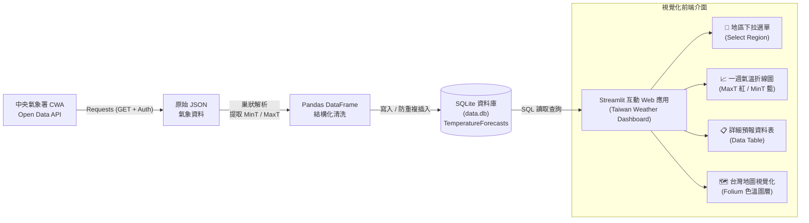

# 🌤️ Taiwan Weather Forecast — 台灣天氣預報互動式應用

[](https://www.python.org/)
[](https://streamlit.io/)
[](https://www.sqlite.org/)
[](https://python-visualization.github.io/folium/)
[](https://opendata.cwa.gov.tw/)
[](https://github.com/zxc22872580/AIoT_L3_CWA_HW1.git)

> **AI 創新微課程：從氣象資料到互動式天氣預報應用**  
> **CWA API × JSON × Python × SQLite × Streamlit × Folium**  
> 
> 💡 *“Code Smarter, Build a Better Tomorrow!”*  
> 🌏 *“用程式探索天氣 · 用資料看見台灣 · 用 AI 實現更多可能”*  
> 🎓 *“煥哥 與你一起 用 AI 寫程式 探索更大的世界！”*

---

## 📖 目錄 (Table of Contents)

- [📌 專案簡介 (Overview)](#-專案簡介-overview)
- [🏗️ 系統架構與資料流 (Architecture & Data Flow)](#️-系統架構與資料流-architecture--data-flow)
- [🛠️ 技術棧與工具鏈 (Tech Stack)](#️-技術棧與工具鏈-tech-stack)
- [🗺️ 24 單元完整學習地圖 (24-Step Roadmap)](#️-24-單元完整學習地圖-24-step-roadmap)
- [🗄️ 資料庫綱要設計 (Database Schema)](#️-資料庫綱要設計-database-schema)
- [🎨 互動視覺化與核心功能 (Dashboard Features)](#-互動視覺化與核心功能-dashboard-features)
- [📂 專案檔案結構 (Project Structure)](#-專案檔案結構-project-structure)
- [🚀 快速開始 (Quick Start)](#-快速開始-quick-start)
- [🛡️ 程式碼品質與防呆設計 (Code Quality & Idempotency)](#️-程式碼品質與防呆設計-code-quality--idempotency)
- [🔮 延伸應用與未來展望 (Future Roadmap)](#-延伸應用與未來展望-future-roadmap)
- [👨‍🏫 導師與致謝 (Acknowledgments)](#-導師與致謝-acknowledgments)

---

## 📌 專案簡介 (Overview)

本專案為 **AIoT 創新微課程（AIoT_L3_CWA_HW1）** 的核心實戰成果。專案建立了一套從**雲端氣象開放資料採集**、**結構化清洗轉換**、**本機關聯式資料庫持久化**，到**前端互動式 Web 儀表板與地理資訊地圖視覺化**的端到端完整工程管線。

### 🌟 核心目標
1. **即時串接**：自動對接交通部中央氣象署（CWA）Open Data API 獲取全台最新氣象預報。
2. **資料工程**：解析多層巢狀 JSON，萃取各地區最高溫（`MaxT`）與最低溫（`MinT`），進行資料規格化。
3. **資料庫儲存**：設計 SQLite 關聯資料庫與主鍵防呆機制，實現多次執行不重複插入的冪等性（Idempotency）。
4. **互動儀表板**：使用 Streamlit 建構現代化介面，提供地區下拉切換、一週高低溫折線趨勢圖及明細資料表。
5. **地理地圖視覺化**：整合 Folium 繪製台灣互動式氣溫地圖，依氣溫區間以色階動態呈現各地預報。

---

## 🏗️ 系統架構與資料流 (Architecture & Data Flow)



---

## 🛠️ 技術棧與工具鏈 (Tech Stack)

| 類別 | 使用技術 | 版本 / 規格 | 用途說明 |
| :--- | :--- | :--- | :--- |
| **程式語言** | `Python` | `3.10+` | 核心邏輯、資料處理與 Web 服務開發 |
| **資料來源** | `CWA Open Data API` | `RESTful / JSON` | 交通部中央氣象署開放資料平台預報資料集 |
| **網路請求** | `Requests` | `2.31+` | HTTP 傳輸、帶入 Authorization Header 獲取 API 資料 |
| **資料清理** | `Pandas` | `2.0+` | 巢狀 JSON 扁平化、型態轉換與 DataFrame 探索 |
| **資料庫** | `SQLite3` | 內建支援 | 輕量化關聯式資料庫，落庫儲存 `data.db` |
| **Web 框架** | `Streamlit` | `1.30+` | 快速構建響應式資料科學 Web 應用儀表板 |
| **地圖視覺化** | `Folium` / `streamlit-folium` | `0.15+` | 台灣地理空間視覺化、溫度區間著色與互動標記 |
| **版本控制** | `Git` / `GitHub` | `Git 2.40+` | 程式碼版本控制、分支管理與雲端代碼託管 |

---

## 🗺️ 24 單元完整學習地圖 (24-Step Roadmap)

本專案嚴格遵循課程規劃之 **24 階段循序漸進實作路線**：

```
┌──────────────────────────────────────────────────────────────────────────────┐
│                  AI 創新微課程：Taiwan Weather Forecast 學習地圖              │
└──────────────────────────────────────────────────────────────────────────────┘
  【第一階段：基礎與資料採集】
    01. 課程介紹 ➔ 02. 台灣的天氣與生活 ➔ 03. 中央氣象署 CWA 平台 ➔ 04. API 資料取得
  【第二階段：資料剖析與建庫】
    05. JSON 資料結構解析 ➔ 06. 提取最高與最低氣溫 ➔ 07. 資料整理與預覽 ➔ 08. 建立 SQLite 資料庫
  【第三階段：資料庫設計與查詢】
    09. 資料庫設計 ➔ 10. 查詢資料驗證 ➔ 11. Streamlit 入門 ➔ 12. 從資料庫讀取資料
  【第四階段：Web 介面整合】
    13. 下拉選單選擇地區 ➔ 14. 繪製折線圖 ➔ 15. 顯示資料表格 ➔ 16. 整合 Web App 介面
  【第五階段：地理地圖視覺化與程式優化】
    17. 進階：台灣地圖視覺化 ➔ 18. 選擇日期顯示地圖 ➔ 19. 完整成果展示 ➔ 20. 程式碼品質與優化
  【第六階段：版本部署與未來延伸】
    21. 專案上傳至 GitHub ➔ 22. 延伸應用與想法 ➔ 23. 回顧與重點整理 ➔ 24. 下一步：繼續探索
```

### 📚 各單元核心實作重點

1. **課程介紹**：確立「AI × 資料 × 天氣 × 實作」主軸，鳥瞰全景學習路徑與專案目標。
2. **台灣的天氣與生活**：認識微氣候對交通、農業、民生影響，建立資料驅動（Data-Driven）思維。
3. **中央氣象署 CWA Open Data 平台**：註冊帳號、取得專屬授權 API Key，挑選適合之預報資料集。
4. **API 資料取得**：使用 `requests.get()` 帶入授權標頭，透過 HTTP 協定取得標準 JSON 格式數據。
   ```python
   import requests

   url = "https://opendata.cwa.gov.tw/api/v1/rest/datastore/F-D0047-091"
   headers = {"Authorization": "CWA-XXXXXXXX-XXXX-XXXX-XXXX-XXXXXXXXXXXX"}
   resp = requests.get(url, headers=headers)
   data = resp.json()
   ```
5. **JSON 資料結構解析**：拆解深層巢狀階層，掌握 `locations` ➔ `locationName` ➔ `weatherElement` 節點。
   ```json
   {
     "locations": [
       {
         "locationName": "中部地區",
         "weatherElement": [
           { "elementName": "MinT" },
           { "elementName": "MaxT" }
         ]
       }
     ]
   }
   ```
6. **提取最高與最低氣溫**：精準萃取 `MinT`（最低溫）與 `MaxT`（最高溫），將時間戳記與溫度轉換為結構化數值。
7. **資料整理與預覽**：使用 Pandas 建立清晰的 DataFrame，即時檢視欄位型態、缺漏值與分區資料。
   | regionName | dataDate | minT | maxT |
   | :--- | :--- | :--- | :--- |
   | 北部地區 | 2026-04-14 | 18 | 26 |
   | 中部地區 | 2026-04-14 | 20 | 30 |
   | 南部地區 | 2026-04-14 | 22 | 31 |
8. **建立 SQLite 資料庫**：建立本地 `data.db` 輕量關聯式資料庫引擎，確保資料持久化。
9. **資料庫設計**：定義專用表 `TemperatureForecasts`，設定主鍵與數值型態。
10. **查詢資料驗證**：透過 SQL 語法進行落庫驗證：
    ```sql
    SELECT DISTINCT regionName FROM TemperatureForecasts;
    SELECT * FROM TemperatureForecasts WHERE regionName = '中部地區';
    ```
11. **Streamlit 入門**：安裝並設定 Streamlit 執行環境，建立第一支 Hello World 網頁程式。
12. **從資料庫讀取資料**：透過 Python `sqlite3` 連線結合 `pd.read_sql_query` 實現動態讀取。
    ```python
    import sqlite3
    import pandas as pd

    conn = sqlite3.connect("data.db")
    df = pd.read_sql_query("SELECT * FROM TemperatureForecasts", conn)
    ```
13. **下拉選單選擇地區**：透過 `st.selectbox` 提供北部、中部、南部、東北部、東部、東南部等地區切換。
14. **繪製折線圖**：繪製一週最高溫（紅色折線）與最低溫（藍色折線）溫度趨勢。
15. **顯示資料表格**：搭配 `st.dataframe` 展示一週氣溫明細表，提升資訊透明度。
16. **整合 Web App 介面**：模組化整合選單、趨勢圖與資料表，打造具一致性視覺的 Taiwan Weather Forecast 頁面。
17. **進階：台灣地圖視覺化**：整合 `Folium` 地圖圖層，依據各地平均溫度套用色階分級。
18. **選擇日期顯示地圖**：提供日期挑選元件，即時動態更新地圖標記與地區氣溫彈窗（Popup）。
19. **完整成果展示 (Taiwan Weather Dashboard)**：整合地圖、圖表與指標卡，呈現高可用性天氣數據看板。
20. **程式碼品質與優化**：加入例外捕獲（Try-Except）、函數化模組封裝、撰寫完整註解，並落實防重複寫入機制。
21. **專案上傳至 GitHub**：建立 Git 版本倉庫、設定 Remote、撰寫標準 Commit 訊息並 Push 至遠端儲存庫。
22. **延伸應用與想法**：構思天氣提醒 Line Bot、旅遊穿搭行程推薦、智慧農業防災與 AI 氣象分析。
23. **回顧與重點整理**：統整 API 串接、JSON 解析、SQLite、Streamlit 與 AI 賦能寫作技巧。
24. **下一步：繼續探索**：邁向更多政府 Open Data、更深度的 AI 輔助開發，持續打造個人專屬專案作品集！

---

## 🗄️ 資料庫綱要設計 (Database Schema)

資料庫檔案路徑：`data.db`  
預報資料表名稱：`TemperatureForecasts`

```sql
CREATE TABLE IF NOT EXISTS TemperatureForecasts (
    id INTEGER PRIMARY KEY AUTOINCREMENT,
    regionName TEXT NOT NULL,
    dataDate TEXT NOT NULL,
    minT REAL NOT NULL,
    maxT REAL NOT NULL,
    UNIQUE(regionName, dataDate) -- 確保重複爬取時不產生重覆資料
);
```

### 欄位規格說明

| 欄位名稱 | 型態 (Type) | 限制條件 (Constraint) | 說明 | 範例資料 |
| :--- | :--- | :--- | :--- | :--- |
| `id` | `INTEGER` | `PRIMARY KEY AUTOINCREMENT` | 唯一流水號識別碼 | `1` |
| `regionName` | `TEXT` | `NOT NULL` | 預報地區名稱 | `北部地區`、`中部地區`、`南部地區` |
| `dataDate` | `TEXT` | `NOT NULL` | 預報日期格式 (`YYYY-MM-DD`) | `2026-04-14` |
| `minT` | `REAL` | `NOT NULL` | 預報當日最低溫度 (°C) | `18.5` |
| `maxT` | `REAL` | `NOT NULL` | 預報當日最高溫度 (°C) | `28.0` |

---

## 🎨 互動視覺化與核心功能 (Dashboard Features)

### 1. 區域選擇與一週氣溫趨勢折線圖
- 支援六大地區切換：`北部地區`、`中部地區`、`南部地區`、`東北部地區`、`東部地區`、`東南部地區`。
- 雙色折線圖對比：
  - 🔴 **最高溫 (MaxT)**：紅色線段，監控日間升溫。
  - 🔵 **最低溫 (MinT)**：藍色線段，掌握夜間與清晨低溫。

### 2. 台灣地理空間溫度地圖 (Folium Map)
地圖依據各地區平均溫度，採用直觀的四段式漸層色彩分級：

| 溫度區間 | 視覺代表色 | 色票代碼 | 天氣感受說明 |
| :---: | :---: | :---: | :--- |
| **< 20°C** | 🔵 **藍色** | `#1E88E5` | 偏涼 / 寒冷 |
| **20 - 25°C** | 🟢 **綠色** | `#43A047` | 舒適 / 宜人 |
| **25 - 30°C** | 🟡 **黃色** | `#FDD835` | 暖熱 / 晴朗 |
| **> 30°C** | 🔴 **紅色** | `#E53935` | 炎熱 / 高溫注意 |

- **互動彈窗 (Popup)**：在地圖上點選特定區域標記時，即刻浮現該地區之預報資訊：
  ```text
  【中部地區】
  最低氣溫：20°C
  最高氣溫：30°C
  平均氣溫：25°C
  ```

---

## 📂 專案檔案結構 (Project Structure)

```text
AIoT_L3_CWA_HW1/
│
├── .git/                      # Git 版本控制目錄
├── .gitignore                 # 忽略快取與虛擬環境檔案
├── README.md                  # 專案完整說明文件與實作指南
├── requirements.txt           # 專案相依套件清單
│
├── fetch_cwa_data.py          # [ETL] CWA API 抓取、JSON 解析與 SQLite 入庫腳本
├── app.py                     # [Web] Streamlit + Folium 互動視覺化儀表板
└── data.db                    # [Database] SQLite 資料庫檔案 (執行爬蟲後自動生成)
```

---

## 🚀 快速開始 (Quick Start)

### 1. 複製儲存庫 (Clone Repository)

```bash
git clone https://github.com/zxc22872580/AIoT_L3_CWA_HW1.git
cd AIoT_L3_CWA_HW1
```

### 2. 建立並啟動虛擬環境 (建議)

```bash
# Windows
python -m venv venv
.\venv\Scripts\activate

# macOS / Linux
python3 -m venv venv
source venv/bin/activate
```

### 3. 安裝相依套件

```bash
pip install -r requirements.txt
```

> **`requirements.txt` 內容範例：**
> ```text
> requests>=2.31.0
> pandas>=2.0.0
> streamlit>=1.30.0
> folium>=0.15.0
> streamlit-folium>=0.17.0
> ```

### 4. 設定中央氣象署 API 金鑰

前往 [交通部中央氣象署開放資料平台](https://opendata.cwa.gov.tw/) 註冊並取得授權金鑰（Authorization Code）：

```bash
# Windows PowerShell
$env:CWA_API_KEY="您的_CWA_API_KEY"

# Linux / macOS
export CWA_API_KEY="您的_CWA_API_KEY"
```

### 5. 執行資料採集與建庫 (ETL)

```bash
python fetch_cwa_data.py
```
*資料庫 `data.db` 將於本機自動生成，並完成各地區最新一週氣溫預報入庫。*

### 6. 啟動 Streamlit 儀表板

```bash
streamlit run app.py
```
*終端機將顯示本地伺服器網址，瀏覽器將自動開啟 `http://localhost:8501`。*

---

## 🛡️ 程式碼品質與防呆設計 (Code Quality & Idempotency)

本專案在實作過程中特別強調以下軟體工程實踐（對應第 20 單元）：

1. **冪等性設計 (Idempotency)**：
   - 資料庫層面使用 `INSERT OR REPLACE INTO` 或 `ON CONFLICT DO UPDATE`，確保多次重複執行資料擷取時，不會重複寫入重複日期的記錄。
2. **強固例外處理 (Robust Error Handling)**：
   - 包含網路超時重試機制（`requests.exceptions.RequestException`）。
   - 針對 CWA API 回傳非 200 狀態碼或 JSON 結構變更時提供優雅降級與錯誤提示。
3. **模組化與高可讀性**：
   - 資料擷取、資料處理、資料庫操作與視圖介面嚴格分層。
   - 所有函式均具備清楚的 Docstring 說明與 Python Type Hints 型別提示。

---

## 🔮 延伸應用與未來展望 (Future Roadmap)

基於本專案之資料管線架構，未來可進一步拓展以下智慧應用（對應第 22 & 24 單元）：

- 🤖 **智慧天氣 Line Bot / Discord 機器人**：
  - 串接 Line Messaging API，每日定時推播當日氣溫差提示、攜帶雨具提醒。
- 🎒 **AI 旅遊與穿搭顧問**：
  - 結合大型語言模型（LLM），根據各地即時高低溫與氣象描述，動態推薦旅行行李穿搭。
- 🌾 **智慧農業與防災預警系統**：
  - 監測極端低溫（寒害）或連日高溫，自動發送農作保溫防災預警簡訊。
- 📊 **多維氣象整合預報**：
  - 擴展支援紫外線指數（UVI）、相對濕度（RH）、降雨機率（PoP）與空氣品質指標（AQI）。

---

## 👨‍🏫 導師與致謝 (Acknowledgments)

- **指導導師**：**煥哥**
- **核心教學心法**：
  > *「技術可以解決問題，但更重要的是用技術創造更好的未來！」 —— 煥哥*
- **專案精神**：
  - 🚀 **Learn Today, Build Tomorrow**
  - 💡 **AI for Learning, AI for a Better Taiwan**

---

<div align="center">
  <b>Taiwan Weather Forecast Dashboard © 2026 Crafted with ❤️ for AIoT Education</b>
</div>
