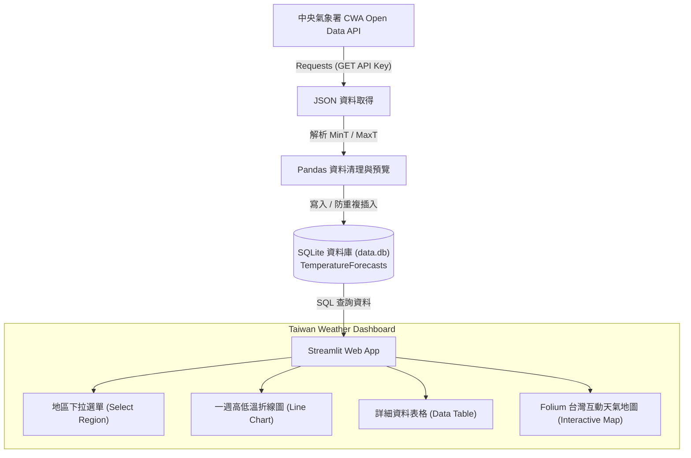

# 🌤️ Taiwan Weather Forecast — 台灣天氣預報互動式 Web App

> **AI 創新微課程：從氣象資料到互動式天氣預報應用**  
> **CWA API × JSON × Python × SQLite × Streamlit × Folium**  
> *"Code Smarter, Build a Better Tomorrow! 用程式探索天氣 · 用資料看見台灣 · 用 AI 實現更多可能"*

---

## 📌 專案簡介 (Overview)

本專案為 **AIoT 創新微課程（AIoT L3 CWA HW1）** 實作成果。全流程涵蓋了從現代資料工程到前端互動可視化的完整生命週期：
1. 串接 **中央氣象署（CWA）Open Data API** 取得即時天氣預報 JSON 資料。
2. 進行巢狀 JSON 解析與資料清洗，擷取各地區之預報日期、最高氣溫（MaxT）與最低氣溫（MinT）。
3. 使用 **SQLite** 關聯式資料庫建立資料表並設計防重複寫入機制，達成結構化持久儲存。
4. 使用 **Streamlit** 快速構建現代化 Web 儀表板，提供使用者下拉選擇地區、動態呈現一週高低溫折線圖與預報資料表。
5. 進階整合 **Folium** 進行台灣互動式地圖視覺化，支援按日期篩選並以溫度級距標記各地氣溫。

---

## 🛠️ 技術架構與使用工具 (Tech Stack)

| 領域 | 技術 / 工具 | 說明 |
| :--- | :--- | :--- |
| **程式語言** | `Python 3.10+` | 核心開發語言 |
| **資料來源** | `CWA Open Data API` | 交通部中央氣象署開放資料平台 |
| **網路請求** | `Requests` | 串接 RESTful API 並獲取 JSON 回應 |
| **資料處理** | `Pandas` / `JSON` | 巢狀結構解析、資料清洗與結構化轉換 |
| **資料庫儲存** | `SQLite3` | 輕量化關聯式資料庫，儲存 `TemperatureForecasts` 資料表 |
| **Web 儀表板** | `Streamlit` | 快速構建互動式資料視覺化 Web 應用程式 |
| **地圖視覺化** | `Folium` / `streamlit-folium` | 台灣地理圖層套疊、溫度區間著色與互動 Pop-up |
| **版本控制** | `Git` / `GitHub` | 程式碼版本管理與開源協作 |

---

## 🔄 系統架構流程 (System Architecture)



---

## 🗄️ 資料庫綱要 (Database Schema)

資料庫檔案：`data.db`  
資料表名稱：`TemperatureForecasts`

| 欄位名稱 | 資料型態 | 屬性 | 說明 | 範例 |
| :--- | :--- | :--- | :--- | :--- |
| `id` | `INTEGER` | `PRIMARY KEY AUTOINCREMENT` | 唯一識別識別碼 | `1` |
| `regionName` | `TEXT` | `NOT NULL` | 預報地區名稱 | `中部地區` |
| `dataDate` | `TEXT` | `NOT NULL` | 預報日期 (YYYY-MM-DD) | `2026-04-14` |
| `minT` | `REAL` | `NOT NULL` | 最低氣溫 (°C) | `20.0` |
| `maxT` | `REAL` | `NOT NULL` | 最高氣溫 (°C) | `30.0` |

---

## 🗺️ 學習地圖與 24 單元核心重點 (Learning Map)

本專案嚴格遵循 **24 單元循序漸進式學習路線** 進行實作：

```
Ch 01-04  【基礎與資料取得】   課程導引 ➔ 天氣與生活 ➔ CWA 平台註冊 ➔ Requests 串接 API
Ch 05-08  【資料剖析與建庫】   JSON 結構拆解 ➔ MinT/MaxT 提取 ➔ Pandas 觀察 ➔ 建立 SQLite
Ch 09-12  【資料設計與查詢】   Schema 設計 ➔ SQL 驗證 ➔ Streamlit 入門 ➔ 資料庫連線查詢
Ch 13-16  【Web 介面整合】    互動下拉選單 ➔ 一週折線圖 ➔ 表格清單 ➔ Web 介面整合
Ch 17-20  【地圖視覺化與優化】 Folium 台灣地圖 ➔ 依日期互動 ➔ 完整 Dashboard ➔ 程式碼重構優化
Ch 21-24  【部署與未來展望】   GitHub 版本管理 ➔ 延伸 Line Bot/AI 應用 ➔ 重點回顧 ➔ 未來探索
```

### 詳細單元內容

1. **課程介紹**：AI × 資料 × 天氣 × 實作導向，建立學習地圖與專案全貌。
2. **台灣的天氣與生活**：探討氣象數據如何影響決策、交通、民生及智慧應用案例。
3. **中央氣象署 CWA Open Data 平台**：註冊開發者帳號、申請專屬授權 API Key 並挑選合適氣象資料集。
4. **API 資料取得**：使用 Python `requests` 庫帶入授權標頭，成功調用 API 獲取 JSON 數據。
5. **JSON 資料結構解析**：深入拆解氣象局回傳之深層巢狀字典與清單，精確定位溫濕度元素節點。
6. **提取最高與最低氣溫**：過濾與萃取 `MinT`（最低溫）及 `MaxT`（最高溫），將半結構化資料重構為扁平記錄。
7. **資料整理與預覽**：透過 `pandas.DataFrame` 檢視資料型態、缺漏值處理並確認資料維度。
8. **建立 SQLite 資料庫**：本機端初始化 `data.db` 輕量化關聯式資料庫引擎。
9. **資料庫設計**：編寫 DDL 語法定義 `TemperatureForecasts` 表結構與主鍵約制。
10. **查詢資料驗證**：利用 `SELECT DISTINCT regionName` 等 SQL 語法驗證資料落庫之正確性與完整度。
11. **Streamlit 入門**：安裝與配置環境，建立基礎應用腳本並實作 Hello World 頁面。
12. **從資料庫讀取資料**：透過 `sqlite3` 與 `pd.read_sql_query` 連線資料庫，動態載入即時預報數據。
13. **下拉選單選擇地區**：利用 `st.selectbox` 提供北部、中部、南部、東北部、東部、東南部等地區切換。
14. **繪製折線圖**：動態繪製一週內最高氣溫（紅色警戒線）與最低氣溫（藍色低溫線）趨勢走向。
15. **顯示資料表格**：搭配 `st.dataframe` 清楚陳列日期與對應氣溫數據，提升資料可讀性。
16. **整合 Web App 介面**：模組化組合選單、折線圖與表格，打造一體化排版介面。
17. **進階：台灣地圖視覺化**：整合 `folium`，依溫度級距標記不同顏色（如 `<20°C`, `20-25°C`, `25-30°C`, `>30°C`）。
18. **選擇日期顯示地圖**：提供 `st.date_input` / 日期選擇元件，動態切換每日台灣各地預報彈窗（Popup）。
19. **完整成果展示 (Taiwan Weather Dashboard)**：融合多維度資訊，展現高互動性且實用的氣象儀表板。
20. **程式碼品質與優化**：模組化封裝、撰寫型別註解、加入例外錯誤處理機制，並確保資料寫入時「重複執行不重複插入」。
21. **專案上傳至 GitHub**：建立遠端 Repository、配置 Remote、版本 Commit 並推送至 GitHub。
22. **延伸應用與想法**：發想結合 Line Notify / Line Bot 天氣警報、智慧旅遊推薦、農業防災調度與 AI 大模型自然語言分析。
23. **回顧與重點整理**：歸納 API 串接、JSON 解析、SQL 資料庫、Streamlit 視覺化之全端資料實作心法。
24. **下一步：繼續探索**：邁向更多 Open Data、大數據串接、AI 輔助 Coding 與個人全端專案作品集打造。

---

## 🚀 快速開始 (Quick Start)

### 1. 複製儲存庫 (Clone Repository)

```bash
git clone https://github.com/zxc22872580/AIoT_L3_CWA_HW1.git
cd AIoT_L3_CWA_HW1
```

### 2. 安裝必要相依套件

```bash
pip install -r requirements.txt
```

*(主要套件包含：`requests`, `pandas`, `streamlit`, `folium`, `streamlit-folium`)*

### 3. 設定氣象署 API Key

至 [交通部中央氣象署開放資料平台](https://opendata.cwa.gov.tw/) 申請 API 金鑰，並配置於環境變數或專案設定中：

```bash
export CWA_API_KEY="您的_API_KEY"
# 或於 Windows PowerShell:
$env:CWA_API_KEY="您的_API_KEY"
```

### 4. 執行爬取與資料庫寫入

```bash
python fetch_cwa_data.py
```

### 5. 啟動 Streamlit 儀表板

```bash
streamlit run app.py
```

瀏覽器將自動開啟 `http://localhost:8501` 呈現互動式氣象儀表板。

---

## 🔮 延伸應用 (Future Roadmap)

- 🤖 **Line Bot 智慧天氣小幫手**：每天清晨自動推播所在縣市當日溫差與降雨提醒。
- 🧭 **AI 旅遊穿搭顧問**：結合 LLM 模型根據當週預報最高/最低溫，自動生成出行與穿著建議。
- 🌾 **智慧農業防災預警**：針對寒害（低溫警報）或極端高溫即時發布預警通知。

---

## 👨‍🏫 導師與致謝 (Acknowledgments)

- **課程導師**：煥哥
- **核心名言**：
  > *「技術可以解決問題，但更重要的是用技術創造更好的未來！」 —— 煥哥*
- **理念倡議**：*Learn Today, Build Tomorrow · AI for Learning, AI for a Better Taiwan*
