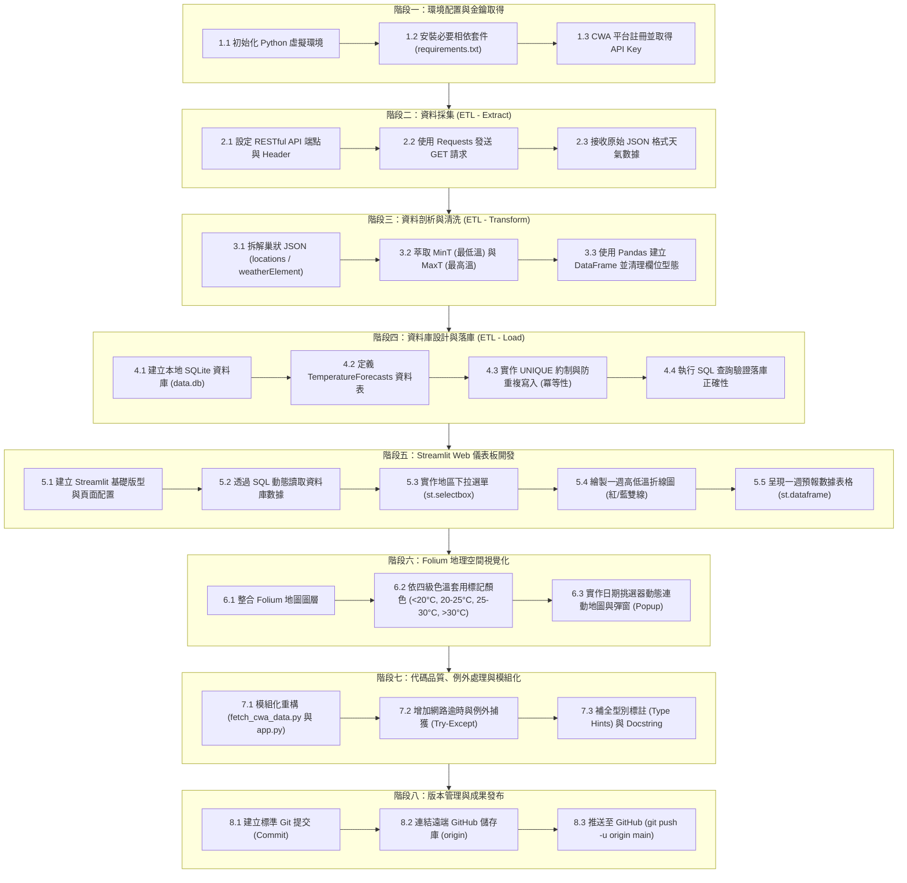

# 📋 Taiwan Weather Forecast — 專案完整實作工作流程 (Project Workflow)

> **專案代號**：AIoT_L3_CWA_HW1  
> **核心架構**：CWA API × JSON × Python × SQLite × Streamlit × Folium  
> **核心精神**：*“Code Smarter, Build a Better Tomorrow!”* —— 煥哥

---

## 🗺️ 工作流程總覽 (Workflow Architecture)

本專案將從中央氣象署 API 資料獲取，到前端 Streamlit 互動儀表板與 Folium 地理圖資視覺化，劃分為 **8 大核心工作階段 (8 Workflow Phases)**，涵蓋完整的現代資料工程與 Web 應用生命週期：



---

## 📌 階段一：環境配置與金鑰取得 (Setup & Preparation)

### 1.1 目錄結構規劃
```text
AIoT_L3_CWA_HW1/
│
├── myplan/
│   └── workflow.md            # 本工作流程定義文檔
├── fetch_cwa_data.py          # 資料擷取、清洗與入庫腳本 (ETL)
├── app.py                     # Streamlit + Folium 前端儀表板
├── requirements.txt           # 套件依賴清單
├── data.db                    # 本地 SQLite 資料庫 (自動生成)
└── README.md                  # 專案入口說明文件
```

### 1.2 相依套件配置 (`requirements.txt`)
- `requests>=2.31.0`：HTTP API 串接
- `pandas>=2.0.0`：資料清理與分析
- `streamlit>=1.30.0`：互動式 Web 儀表板
- `folium>=0.15.0`：地理資訊地圖
- `streamlit-folium>=0.17.0`：Streamlit 地圖組件橋接

### 1.3 取得 CWA API Key
1. 註冊 [中央氣象署開放資料平台](https://opendata.cwa.gov.tw/)。
2. 取得個人授權碼（Authorization Code，格式如：`CWA-XXXXXXXX-XXXX-XXXX-XXXX-XXXXXXXXXXXX`）。
3. 將金鑰配置至環境變數：
   ```powershell
   $env:CWA_API_KEY="您的_CWA_API_KEY"
   ```

---

## 📌 階段二：資料採集 (Data Extraction)

### 2.1 API 規格
- **端點 (Endpoint)**：一般天氣預報 - 臺灣各縣市未來 1 週天氣預報（或鄉鎮天氣預報）
- **呼叫方式**：`GET`
- **授權標頭**：`Authorization: {CWA_API_KEY}`

### 2.2 核心程式碼範例
```python
import os
import requests

API_KEY = os.getenv("CWA_API_KEY", "YOUR_API_KEY")
URL = "https://opendata.cwa.gov.tw/api/v1/rest/datastore/F-D0047-091"

headers = {
    "Authorization": API_KEY,
    "accept": "application/json"
}

response = requests.get(URL, headers=headers, timeout=10)
response.raise_for_status()
raw_json = response.json()
```

---

## 📌 階段三：資料剖析與清洗 (Data Transformation)

### 3.1 巢狀 JSON 結構定位
- 路徑：`records` ➔ `locations[0]` ➔ `location[]`
- 地區名稱：`locationName`（如：`北部地區`、`中部地區`、`南部地區` 等）
- 氣象要素陣列：`weatherElement[]`
  - `elementName == "MinT"`：一週最低氣溫預報
  - `elementName == "MaxT"`：一週最高氣溫預報

### 3.2 結構化扁平輸出格式
透過 Pandas 將深層結構轉換為乾淨的扁平二維表格：

| regionName | dataDate | minT | maxT |
| :--- | :--- | :---: | :---: |
| 北部地區 | 2026-04-14 | 18.0 | 26.0 |
| 中部地區 | 2026-04-14 | 20.0 | 30.0 |
| 南部地區 | 2026-04-14 | 22.0 | 31.0 |

---

## 📌 階段四：資料庫設計與落庫 (Data Storage & Loading)

### 4.1 SQLite Schema 設計
```sql
CREATE TABLE IF NOT EXISTS TemperatureForecasts (
    id INTEGER PRIMARY KEY AUTOINCREMENT,
    regionName TEXT NOT NULL,
    dataDate TEXT NOT NULL,
    minT REAL NOT NULL,
    maxT REAL NOT NULL,
    UNIQUE(regionName, dataDate) ON CONFLICT REPLACE
);
```

### 4.2 冪等性與防重複寫入 (Idempotency)
- 透過 `UNIQUE(regionName, dataDate) ON CONFLICT REPLACE` 約制，確保腳本多次執行時會更新既有數據，絕不產生重覆資料。

### 4.3 落庫查詢驗證
```python
import sqlite3
import pandas as pd

conn = sqlite3.connect("data.db")
# 驗證有哪些地區
regions = pd.read_sql_query("SELECT DISTINCT regionName FROM TemperatureForecasts", conn)
print("入庫地區：", regions['regionName'].tolist())

# 驗證單一地區資料筆數
df_sample = pd.read_sql_query(
    "SELECT * FROM TemperatureForecasts WHERE regionName = '中部地區' ORDER BY dataDate ASC", 
    conn
)
print(df_sample)
conn.close()
```

---

## 📌 階段五：Streamlit 互動儀表板 (Web Dashboard)

### 5.1 頁面佈局與風格
- 使用 `st.set_page_config(page_title="Taiwan Weather Forecast", layout="wide")`。
- 頂部顯示大標題、副標題與煥哥教學精神引言。
- 側邊欄（Sidebar）配置：
  - 資料庫狀態指標（最後更新時間、總資料筆數）
  - 全域參數篩選

### 5.2 核心互動元件
1. **地區選擇器 (`st.selectbox`)**：
   - 選項涵蓋：北部地區、中部地區、南部地區、東北部地區、東部地區、東南部地區。
2. **一週氣溫趨勢折線圖 (Line Chart)**：
   - 紅線：最高氣溫 (`MaxT`)
   - 藍線：最低氣溫 (`MinT`)
   - X 軸：預報日期 (`dataDate`)
3. **明細資料表格 (`st.dataframe`)**：
   - 清晰羅列各天之預報日期、最低氣溫、最高氣溫與當日溫差。

---

## 📌 階段六：Folium 地理空間視覺化 (Map Integration)

### 6.1 色階定義 (Temperature Color Scale)
依據各地預報之平均溫度 `(minT + maxT) / 2` 進行動態上色：

| 溫度範圍 | 代表色 | 視覺意涵 |
| :---: | :---: | :--- |
| `< 20°C` | 🔵 藍色 (`#1E88E5`) | 偏涼、寒冷 |
| `20°C ~ 25°C` | 🟢 綠色 (`#43A047`) | 舒適、宜人 |
| `25°C ~ 30°C` | 🟡 黃色 (`#FDD835`) | 暖熱、晴朗 |
| `> 30°C` | 🔴 紅色 (`#E53935`) | 炎熱、注意防曬 |

### 6.2 互動彈窗 (Popup)
- 在地圖各區域中心點標註 CircleMarker。
- 點擊標記浮現 Popup，顯示當日地區預報詳情。

---

## 📌 階段七：程式品質優化與防呆 (Code Quality)

1. **模組解耦**：
   - `fetch_cwa_data.py`：純 ETL 邏輯，可設定定時排程執行。
   - `app.py`：純前端視圖與展示邏輯，只對 SQLite 資料庫進行唯讀查詢。
2. **防禦性設計**：
   - 捕捉網路超時 (`requests.exceptions.Timeout`) 與連線中斷。
   - 資料庫連線使用 context manager (`with sqlite3.connect(...)`) 確保資源釋放。
3. **清晰註解與型別標記**：
   - 每個函數均包含說明輸入與輸出的 Type Hints。

---

## 📌 階段八：Git 版本控制與發布 (Deployment & Release)

```powershell
# 1. 檢視檔案變更狀態
git status

# 2. 將變更加入暫存區
git add .

# 3. 提交版本變更
git commit -m "feat: complete project workflow definition and documentation"

# 4. 推送至遠端 GitHub 儲存庫
git push -u origin main
```

---

## 🔮 延伸應用里程碑 (Next Steps & Milestones)

- [ ] **Milestone 1**：實作 `fetch_cwa_data.py` 資料採集與入庫腳本。
- [ ] **Milestone 2**：實作 `app.py` Streamlit 互動儀表板與 Folium 地圖。
- [ ] **Milestone 3**：設定 GitHub Actions 定時執行 ETL 流程自動更新氣象數據。
- [ ] **Milestone 4**：整合 Line Bot API 提供每日天氣預報推播。
- [ ] **Milestone 5**：結合 AI 大語言模型（LLM）提供智慧穿搭與旅遊建議。
